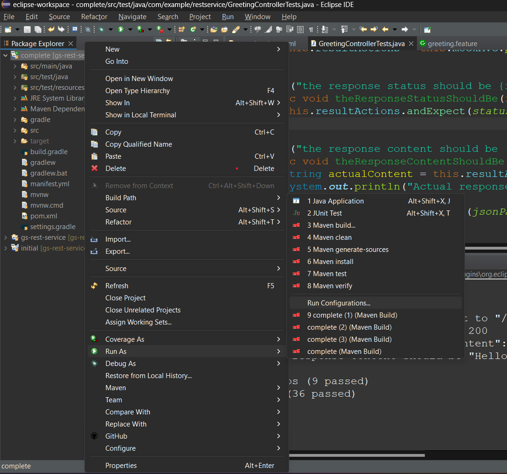
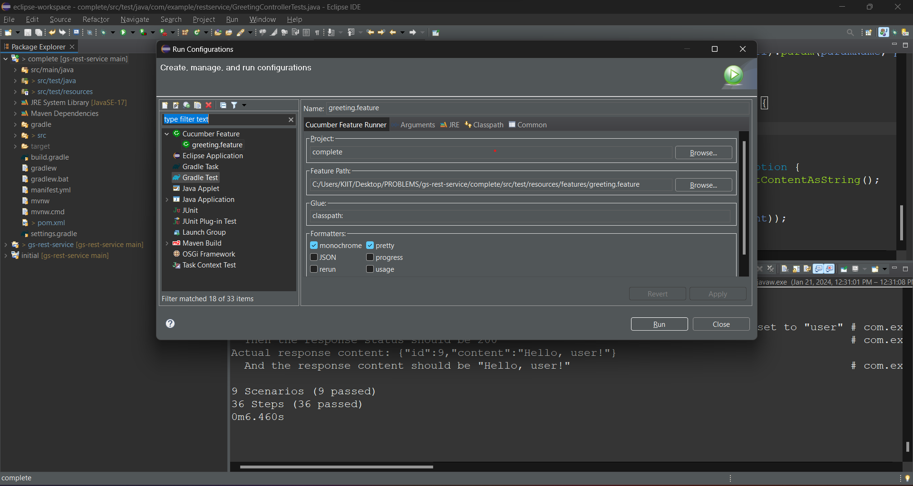

# Cucumber Testing in Spring Boot Documentation

## Table of Contents

1. [Introduction](#introduction)
2. [Setup Cucumber in a Spring Boot Project](#setup-cucumber-in-a-spring-boot-project)
    - [Add Cucumber Dependencies](#add-cucumber-dependencies)
    - [Configure Cucumber in the Project](#configure-cucumber-in-the-project)
3. [Writing Feature Files](#writing-feature-files)
    - [Create Feature Files](#create-feature-files)
    - [Write Gherkin Syntax](#write-gherkin-syntax)
4. [Implementing Step Definitions](#implementing-step-definitions)
    - [Create Step Definition Class](#create-step-definition-class)
    - [Injecting Dependencies](#injecting-dependencies)
5. [Executing Cucumber Tests](#executing-cucumber-tests)
    - [Run Cucumber Tests](#run-cucumber-tests)
6. [Troubleshooting](#troubleshooting)

## 1. Introduction

Cucumber is a popular tool for behavior-driven development (BDD) that allows you to write feature files describing the expected behavior of your application in a natural language format called Gherkin. This documentation provides a step-by-step guide on setting up Cucumber in a Spring Boot project, writing feature files, implementing step definitions, and executing tests.

## 2. Setup Cucumber in a Spring Boot Project

### Add Cucumber Dependencies

1. Open your `pom.xml` file.
2. Add the following dependencies for Cucumber in the `<dependencies>` section:

```xml
<dependencies>
    <!-- ... other dependencies ... -->
    <dependency>
        <groupId>io.cucumber</groupId>
        <artifactId>cucumber-java</artifactId>
        <version>7.15.0</version> <!-- Use the latest version available -->
        <scope>test</scope>
    </dependency>
    <dependency>
        <groupId>io.cucumber</groupId>
        <artifactId>cucumber-spring</artifactId>
        <version>7.14.0</version> <!-- Use the latest version available -->
        <scope>test</scope>
    </dependency>
</dependencies>
```

### Configure Cucumber in the Project

Creating a Cucumber context configuration using Annotation `@CucumberContextConfiguration`:

```java
import io.cucumber.spring.CucumberContextConfiguration;
import org.springframework.boot.test.context.SpringBootTest;
import org.springframework.test.context.ContextConfiguration;

@SpringBootTest(webEnvironment = SpringBootTest.WebEnvironment.RANDOM_PORT)
@CucumberContextConfiguration
public class CucumberConfig {
    // Add any additional configuration if needed
}
```

## 3. Writing Feature Files

### Create Feature Files

1. Create a `src/test/resources` directory in your project.
2. Inside the `resources` directory, create a `features` directory.
3. Inside the `features` directory, create `.feature` files for your scenarios. For example, `greeting.feature`.

### Write Gherkin Syntax

Write Gherkin syntax in your feature files. Example:

```gherkin
Feature: Greeting API

  @GreetingAPI
  Scenario: No parameter greeting should return default message
    Given the server is running
    When the client sends a GET request to "/greeting"
    Then the response status should be 200
    And the response content should be "Hello, World!"

  @GreetingAPI
  Scenario: Parameterized greeting should return tailored message for Adwitiya
    Given the server is running
    When the client sends a GET request to "/greeting" with the parameter "name" set to "Adwitiya"
    Then the response status should be 200
    And the response content should be "Hello, Adwitiya!"
```

## 4. Implementing Step Definitions

### Create Step Definition Class

1. Create a new Java class, for example, `GreetingControllerTests.java`.
2. Annotate the class with `@SpringBootTest`, `@AutoConfigureMockMvc`, and `@CucumberContextConfiguration`.
3. Implement step definitions in this class using Cucumber annotations (`@When`, `@Then`, etc.).

### Injecting Dependencies

Use dependency injection to inject dependencies, such as `MockMvc`. Example:

```java
import org.springframework.beans.factory.annotation.Autowired;
import org.springframework.boot.test.autoconfigure.web.servlet.AutoConfigureMockMvc;
import org.springframework.boot.test.context.SpringBootTest;
import org.springframework.test.web.servlet.MockMvc;

@SpringBootTest(webEnvironment = SpringBootTest.WebEnvironment.RANDOM_PORT)
@AutoConfigureMockMvc
@CucumberContextConfiguration
public class GreetingControllerTests {

    @Autowired
    private MockMvc mockMvc;

    // Implement step definitions
}
```

## 5. Executing Cucumber Tests

### Run Cucumber Tests

1. Right click on your project, go to `Run As`, click `Run Configurations...`.

2. Create a configuration similar to the given image below.

3. Select `Run` to execute the Cucumber tests.
*Note: We need not create new configurations everytime, we can execute the configuration created earlier.*


## 6. Troubleshooting

If your tests fail, consider the following steps:

- Check the console output for error messages.
- Ensure that your step definitions match the Gherkin syntax in the feature files.
- Verify that dependencies are injected correctly in your test class.
- Check for typos or syntax errors in your feature files.

By following these steps, you should be able to set up Cucumber in your Spring Boot project, write feature files, implement step definitions, and execute tests. If you encounter issues, refer to the troubleshooting section for guidance.

## 7. Cucumber Report Analysis

<details>
  <summary>Cucumber Report</summary>

```bash
Jan 21, 2024 1:13:48 PM cucumber.api.cli.Main run
WARNING: You are using deprecated Main class. Please use io.cucumber.core.cli.Main
13:13:49.843 [main] INFO org.springframework.test.context.support.AnnotationConfigContextLoaderUtils -- Could not detect default configuration classes for test class [com.example.restservice.GreetingControllerTests]: GreetingControllerTests does not declare any static, non-private, non-final, nested classes annotated with @Configuration.
13:13:50.020 [main] INFO org.springframework.boot.test.context.SpringBootTestContextBootstrapper -- Found @SpringBootConfiguration com.example.restservice.RestServiceApplication for test class com.example.restservice.GreetingControllerTests

  .   ____          _            __ _ _
 /\\ / ___'_ __ _ _(_)_ __  __ _ \ \ \ \
( ( )\___ | '_ | '_| | '_ \/ _` | \ \ \ \
 \\/  ___)| |_)| | | | | || (_| |  ) ) ) )
  '  |____| .__|_| |_|_| |_\__, | / / / /
 =========|_|==============|___/=/_/_/_/
 :: Spring Boot ::                (v3.2.0)

2024-01-21T13:13:50.581+05:30  INFO 10992 --- [           main] c.e.restservice.GreetingControllerTests  : Starting GreetingControllerTests using Java 17.0.8.1 with PID 10992 (C:\Users\KIIT\Desktop\PROBLEMS\gs-rest-service\complete\target\test-classes started by KIIT in C:\Users\KIIT\Desktop\PROBLEMS\gs-rest-service\complete)
2024-01-21T13:13:50.584+05:30  INFO 10992 --- [           main] c.e.restservice.GreetingControllerTests  : No active profile set, falling back to 1 default profile: "default"
2024-01-21T13:13:52.459+05:30  INFO 10992 --- [           main] o.s.b.w.embedded.tomcat.TomcatWebServer  : Tomcat initialized with port 0 (http)
2024-01-21T13:13:52.481+05:30  INFO 10992 --- [           main] o.apache.catalina.core.StandardService   : Starting service [Tomcat]
2024-01-21T13:13:52.482+05:30  INFO 10992 --- [           main] o.apache.catalina.core.StandardEngine    : Starting Servlet engine: [Apache Tomcat/10.1.16]
2024-01-21T13:13:52.652+05:30  INFO 10992 --- [           main] o.a.c.c.C.[Tomcat].[localhost].[/]       : Initializing Spring embedded WebApplicationContext
2024-01-21T13:13:52.654+05:30  INFO 10992 --- [           main] w.s.c.ServletWebServerApplicationContext : Root WebApplicationContext: initialization completed in 1664 ms
2024-01-21T13:13:53.252+05:30  INFO 10992 --- [           main] o.a.c.c.C.[Tomcat].[localhost].[/]       : Initializing Spring TestDispatcherServlet ''
2024-01-21T13:13:53.253+05:30  INFO 10992 --- [           main] o.s.t.web.servlet.TestDispatcherServlet  : Initializing Servlet ''
2024-01-21T13:13:53.255+05:30  INFO 10992 --- [           main] o.s.t.web.servlet.TestDispatcherServlet  : Completed initialization in 2 ms
2024-01-21T13:13:53.383+05:30  INFO 10992 --- [           main] o.s.b.w.embedded.tomcat.TomcatWebServer  : Tomcat started on port 54640 (http) with context path ''
2024-01-21T13:13:53.403+05:30  INFO 10992 --- [           main] c.e.restservice.GreetingControllerTests  : Started GreetingControllerTests in 3.234 seconds (process running for 5.417)

@GreetingAPI
Scenario: No parameter greeting should return default message # src/test/resources/features/greeting.feature:4
Server is running on port: 54640
Server process ID: 10992
  Given the server is running                                 # com.example.restservice.GreetingControllerTests.theServerIsRunning()

MockHttpServletRequest:
      HTTP Method = GET
      Request URI = /greeting
       Parameters = {}
          Headers = []
             Body = null
    Session Attrs = {}

Handler:
             Type = com.example.restservice.GreetingController
           Method = com.example.restservice.GreetingController#greeting(String)

Async:
    Async started = false
     Async result = null

Resolved Exception:
             Type = null

ModelAndView:
        View name = null
             View = null
            Model = null

FlashMap:
       Attributes = null

MockHttpServletResponse:
           Status = 200
    Error message = null
          Headers = [Content-Type:"application/json"]
     Content type = application/json
             Body = {"id":1,"content":"Hello, World!"}
    Forwarded URL = null
   Redirected URL = null
          Cookies = []
  When the client sends a GET request to "/greeting"          # com.example.restservice.GreetingControllerTests.theClientSendsAGETRequestTo(java.lang.String)
  Then the response status should be 200                      # com.example.restservice.GreetingControllerTests.theResponseStatusShouldBe(int)
Actual response content: {"id":1,"content":"Hello, World!"}
  And the response content should be "Hello, World!"          # com.example.restservice.GreetingControllerTests.theResponseContentShouldBe(java.lang.String)
2024-01-21T13:13:55.001+05:30  INFO 10992 --- [           main] t.c.s.AnnotationConfigContextLoaderUtils : Could not detect default configuration classes for test class [com.example.restservice.GreetingControllerTests]: GreetingControllerTests does not declare any static, non-private, non-final, nested classes annotated with @Configuration.
2024-01-21T13:13:55.007+05:30  INFO 10992 --- [           main] .b.t.c.SpringBootTestContextBootstrapper : Found @SpringBootConfiguration com.example.restservice.RestServiceApplication for test class com.example.restservice.GreetingControllerTests

@GreetingAPI
Scenario: Parameterized greeting should return tailored message for User                     # src/test/resources/features/greeting.feature:11
Server is running on port: 54640
Server process ID: 10992
  Given the server is running                                                                # com.example.restservice.GreetingControllerTests.theServerIsRunning()

MockHttpServletRequest:
      HTTP Method = GET
      Request URI = /greeting
       Parameters = {name=[User]}
          Headers = []
             Body = null
    Session Attrs = {}

Handler:
             Type = com.example.restservice.GreetingController
           Method = com.example.restservice.GreetingController#greeting(String)

Async:
    Async started = false
     Async result = null

Resolved Exception:
             Type = null

ModelAndView:
        View name = null
             View = null
            Model = null

FlashMap:
       Attributes = null

MockHttpServletResponse:
           Status = 200
    Error message = null
          Headers = [Content-Type:"application/json"]
     Content type = application/json
             Body = {"id":2,"content":"Hello, User!"}
    Forwarded URL = null
   Redirected URL = null
          Cookies = []
  When the client sends a GET request to "/greeting" with the parameter "name" set to "User" # com.example.restservice.GreetingControllerTests.theClientSendsAGETRequestToWithTheParameterSetTo(java.lang.String,java.lang.String,java.lang.String)
  Then the response status should be 200                                                     # com.example.restservice.GreetingControllerTests.theResponseStatusShouldBe(int)
Actual response content: {"id":2,"content":"Hello, User!"}
  And the response content should be "Hello, User!"                                          # com.example.restservice.GreetingControllerTests.theResponseContentShouldBe(java.lang.String)
2024-01-21T13:13:55.033+05:30  INFO 10992 --- [           main] t.c.s.AnnotationConfigContextLoaderUtils : Could not detect default configuration classes for test class [com.example.restservice.GreetingControllerTests]: GreetingControllerTests does not declare any static, non-private, non-final, nested classes annotated with @Configuration.
2024-01-21T13:13:55.037+05:30  INFO 10992 --- [           main] .b.t.c.SpringBootTestContextBootstrapper : Found @SpringBootConfiguration com.example.restservice.RestServiceApplication for test class com.example.restservice.GreetingControllerTests

@GreetingAPI
Scenario: Parameterized greeting should return tailored message for Adwitiya                     # src/test/resources/features/greeting.feature:18
Server is running on port: 54640
Server process ID: 10992
  Given the server is running                                                                    # com.example.restservice.GreetingControllerTests.theServerIsRunning()

MockHttpServletRequest:
      HTTP Method = GET
      Request URI = /greeting
       Parameters = {name=[Adwitiya]}
          Headers = []
             Body = null
    Session Attrs = {}

Handler:
             Type = com.example.restservice.GreetingController
           Method = com.example.restservice.GreetingController#greeting(String)

Async:
    Async started = false
     Async result = null

Resolved Exception:
             Type = null

ModelAndView:
        View name = null
             View = null
            Model = null

FlashMap:
       Attributes = null

MockHttpServletResponse:
           Status = 200
    Error message = null
          Headers = [Content-Type:"application/json"]
     Content type = application/json
             Body = {"id":3,"content":"Hello, Adwitiya!"}
    Forwarded URL = null
   Redirected URL = null
          Cookies = []
  When the client sends a GET request to "/greeting" with the parameter "name" set to "Adwitiya" # com.example.restservice.GreetingControllerTests.theClientSendsAGETRequestToWithTheParameterSetTo(java.lang.String,java.lang.String,java.lang.String)
  Then the response status should be 200                                                         # com.example.restservice.GreetingControllerTests.theResponseStatusShouldBe(int)
Actual response content: {"id":3,"content":"Hello, Adwitiya!"}
  And the response content should be "Hello, Adwitiya!"                                          # com.example.restservice.GreetingControllerTests.theResponseContentShouldBe(java.lang.String)
2024-01-21T13:13:55.062+05:30  INFO 10992 --- [           main] t.c.s.AnnotationConfigContextLoaderUtils : Could not detect default configuration classes for test class [com.example.restservice.GreetingControllerTests]: GreetingControllerTests does not declare any static, non-private, non-final, nested classes annotated with @Configuration.
2024-01-21T13:13:55.067+05:30  INFO 10992 --- [           main] .b.t.c.SpringBootTestContextBootstrapper : Found @SpringBootConfiguration com.example.restservice.RestServiceApplication for test class com.example.restservice.GreetingControllerTests

@GreetingAPI
Scenario: Parameterized greeting should return tailored message for empty name           # src/test/resources/features/greeting.feature:25
Server is running on port: 54640
Server process ID: 10992
  Given the server is running                                                            # com.example.restservice.GreetingControllerTests.theServerIsRunning()

MockHttpServletRequest:
      HTTP Method = GET
      Request URI = /greeting
       Parameters = {name=[]}
          Headers = []
             Body = null
    Session Attrs = {}

Handler:
             Type = com.example.restservice.GreetingController
           Method = com.example.restservice.GreetingController#greeting(String)

Async:
    Async started = false
     Async result = null

Resolved Exception:
             Type = null

ModelAndView:
        View name = null
             View = null
            Model = null

FlashMap:
       Attributes = null

MockHttpServletResponse:
           Status = 200
    Error message = null
          Headers = [Content-Type:"application/json"]
     Content type = application/json
             Body = {"id":4,"content":"Hello, World!"}
    Forwarded URL = null
   Redirected URL = null
          Cookies = []
  When the client sends a GET request to "/greeting" with the parameter "name" set to "" # com.example.restservice.GreetingControllerTests.theClientSendsAGETRequestToWithTheParameterSetTo(java.lang.String,java.lang.String,java.lang.String)
  Then the response status should be 200                                                 # com.example.restservice.GreetingControllerTests.theResponseStatusShouldBe(int)
Actual response content: {"id":4,"content":"Hello, World!"}
  And the response content should be "Hello, World!"                                     # com.example.restservice.GreetingControllerTests.theResponseContentShouldBe(java.lang.String)
2024-01-21T13:13:55.094+05:30  INFO 10992 --- [           main] t.c.s.AnnotationConfigContextLoaderUtils : Could not detect default configuration classes for test class [com.example.restservice.GreetingControllerTests]: GreetingControllerTests does not declare any static, non-private, non-final, nested classes annotated with @Configuration.
2024-01-21T13:13:55.100+05:30  INFO 10992 --- [           main] .b.t.c.SpringBootTestContextBootstrapper : Found @SpringBootConfiguration com.example.restservice.RestServiceApplication for test class com.example.restservice.GreetingControllerTests

@GreetingAPI
Scenario: Parameterized greeting should return tailored message for long name                                          # src/test/resources/features/greeting.feature:32
Server is running on port: 54640
Server process ID: 10992
  Given the server is running                                                                                          # com.example.restservice.GreetingControllerTests.theServerIsRunning()

MockHttpServletRequest:
      HTTP Method = GET
      Request URI = /greeting
       Parameters = {name=[VeryLongNameForTestingPurposes]}
          Headers = []
             Body = null
    Session Attrs = {}

Handler:
             Type = com.example.restservice.GreetingController
           Method = com.example.restservice.GreetingController#greeting(String)

Async:
    Async started = false
     Async result = null

Resolved Exception:
             Type = null

ModelAndView:
        View name = null
             View = null
            Model = null

FlashMap:
       Attributes = null

MockHttpServletResponse:
           Status = 200
    Error message = null
          Headers = [Content-Type:"application/json"]
     Content type = application/json
             Body = {"id":5,"content":"Hello, VeryLongNameForTestingPurposes!"}
    Forwarded URL = null
   Redirected URL = null
          Cookies = []
  When the client sends a GET request to "/greeting" with the parameter "name" set to "VeryLongNameForTestingPurposes" # com.example.restservice.GreetingControllerTests.theClientSendsAGETRequestToWithTheParameterSetTo(java.lang.String,java.lang.String,java.lang.String)
  Then the response status should be 200                                                                               # com.example.restservice.GreetingControllerTests.theResponseStatusShouldBe(int)
Actual response content: {"id":5,"content":"Hello, VeryLongNameForTestingPurposes!"}
  And the response content should be "Hello, VeryLongNameForTestingPurposes!"                                          # com.example.restservice.GreetingControllerTests.theResponseContentShouldBe(java.lang.String)
2024-01-21T13:13:55.123+05:30  INFO 10992 --- [           main] t.c.s.AnnotationConfigContextLoaderUtils : Could not detect default configuration classes for test class [com.example.restservice.GreetingControllerTests]: GreetingControllerTests does not declare any static, non-private, non-final, nested classes annotated with @Configuration.
2024-01-21T13:13:55.129+05:30  INFO 10992 --- [           main] .b.t.c.SpringBootTestContextBootstrapper : Found @SpringBootConfiguration com.example.restservice.RestServiceApplication for test class com.example.restservice.GreetingControllerTests

@GreetingAPI
Scenario: Parameterized greeting should return tailored message for special characters in name   # src/test/resources/features/greeting.feature:39
Server is running on port: 54640
Server process ID: 10992
  Given the server is running                                                                    # com.example.restservice.GreetingControllerTests.theServerIsRunning()

MockHttpServletRequest:
      HTTP Method = GET
      Request URI = /greeting
       Parameters = {name=[@#$%^&()]}
          Headers = []
             Body = null
    Session Attrs = {}

Handler:
             Type = com.example.restservice.GreetingController
           Method = com.example.restservice.GreetingController#greeting(String)

Async:
    Async started = false
     Async result = null

Resolved Exception:
             Type = null

ModelAndView:
        View name = null
             View = null
            Model = null

FlashMap:
       Attributes = null

MockHttpServletResponse:
           Status = 200
    Error message = null
          Headers = [Content-Type:"application/json"]
     Content type = application/json
             Body = {"id":6,"content":"Hello, @#$%^&()!"}
    Forwarded URL = null
   Redirected URL = null
          Cookies = []
  When the client sends a GET request to "/greeting" with the parameter "name" set to "@#$%^&()" # com.example.restservice.GreetingControllerTests.theClientSendsAGETRequestToWithTheParameterSetTo(java.lang.String,java.lang.String,java.lang.String)
  Then the response status should be 200                                                         # com.example.restservice.GreetingControllerTests.theResponseStatusShouldBe(int)
Actual response content: {"id":6,"content":"Hello, @#$%^&()!"}
  And the response content should be "Hello, @#$%^&()!"                                          # com.example.restservice.GreetingControllerTests.theResponseContentShouldBe(java.lang.String)
2024-01-21T13:13:55.157+05:30  INFO 10992 --- [           main] t.c.s.AnnotationConfigContextLoaderUtils : Could not detect default configuration classes for test class [com.example.restservice.GreetingControllerTests]: GreetingControllerTests does not declare any static, non-private, non-final, nested classes annotated with @Configuration.
2024-01-21T13:13:55.164+05:30  INFO 10992 --- [           main] .b.t.c.SpringBootTestContextBootstrapper : Found @SpringBootConfiguration com.example.restservice.RestServiceApplication for test class com.example.restservice.GreetingControllerTests

@GreetingAPI
Scenario: Parameterized greeting should return tailored message for numeric name              # src/test/resources/features/greeting.feature:45
Server is running on port: 54640
Server process ID: 10992
  Given the server is running                                                                 # com.example.restservice.GreetingControllerTests.theServerIsRunning()

MockHttpServletRequest:
      HTTP Method = GET
      Request URI = /greeting
       Parameters = {name=[12345]}
          Headers = []
             Body = null
    Session Attrs = {}

Handler:
             Type = com.example.restservice.GreetingController
           Method = com.example.restservice.GreetingController#greeting(String)

Async:
    Async started = false
     Async result = null

Resolved Exception:
             Type = null

ModelAndView:
        View name = null
             View = null
            Model = null

FlashMap:
       Attributes = null

MockHttpServletResponse:
           Status = 200
    Error message = null
          Headers = [Content-Type:"application/json"]
     Content type = application/json
             Body = {"id":7,"content":"Hello, 12345!"}
    Forwarded URL = null
   Redirected URL = null
          Cookies = []
  When the client sends a GET request to "/greeting" with the parameter "name" set to "12345" # com.example.restservice.GreetingControllerTests.theClientSendsAGETRequestToWithTheParameterSetTo(java.lang.String,java.lang.String,java.lang.String)
  Then the response status should be 200                                                      # com.example.restservice.GreetingControllerTests.theResponseStatusShouldBe(int)
Actual response content: {"id":7,"content":"Hello, 12345!"}
  And the response content should be "Hello, 12345!"                                          # com.example.restservice.GreetingControllerTests.theResponseContentShouldBe(java.lang.String)
2024-01-21T13:13:55.198+05:30  INFO 10992 --- [           main] t.c.s.AnnotationConfigContextLoaderUtils : Could not detect default configuration classes for test class [com.example.restservice.GreetingControllerTests]: GreetingControllerTests does not declare any static, non-private, non-final, nested classes annotated with @Configuration.
2024-01-21T13:13:55.204+05:30  INFO 10992 --- [           main] .b.t.c.SpringBootTestContextBootstrapper : Found @SpringBootConfiguration com.example.restservice.RestServiceApplication for test class com.example.restservice.GreetingControllerTests

@GreetingAPI
Scenario: Parameterized greeting should return tailored message for mixed characters in name       # src/test/resources/features/greeting.feature:52
Server is running on port: 54640
Server process ID: 10992
  Given the server is running                                                                      # com.example.restservice.GreetingControllerTests.theServerIsRunning()

MockHttpServletRequest:
      HTTP Method = GET
      Request URI = /greeting
       Parameters = {name=[User123!@#]}
          Headers = []
             Body = null
    Session Attrs = {}

Handler:
             Type = com.example.restservice.GreetingController
           Method = com.example.restservice.GreetingController#greeting(String)

Async:
    Async started = false
     Async result = null

Resolved Exception:
             Type = null

ModelAndView:
        View name = null
             View = null
            Model = null

FlashMap:
       Attributes = null

MockHttpServletResponse:
           Status = 200
    Error message = null
          Headers = [Content-Type:"application/json"]
     Content type = application/json
             Body = {"id":8,"content":"Hello, User123!@#!"}
    Forwarded URL = null
   Redirected URL = null
          Cookies = []
  When the client sends a GET request to "/greeting" with the parameter "name" set to "User123!@#" # com.example.restservice.GreetingControllerTests.theClientSendsAGETRequestToWithTheParameterSetTo(java.lang.String,java.lang.String,java.lang.String)
  Then the response status should be 200                                                           # com.example.restservice.GreetingControllerTests.theResponseStatusShouldBe(int)
Actual response content: {"id":8,"content":"Hello, User123!@#!"}
  And the response content should be "Hello, User123!@#!"                                          # com.example.restservice.GreetingControllerTests.theResponseContentShouldBe(java.lang.String)
2024-01-21T13:13:55.235+05:30  INFO 10992 --- [           main] t.c.s.AnnotationConfigContextLoaderUtils : Could not detect default configuration classes for test class [com.example.restservice.GreetingControllerTests]: GreetingControllerTests does not declare any static, non-private, non-final, nested classes annotated with @Configuration.
2024-01-21T13:13:55.240+05:30  INFO 10992 --- [           main] .b.t.c.SpringBootTestContextBootstrapper : Found @SpringBootConfiguration com.example.restservice.RestServiceApplication for test class com.example.restservice.GreetingControllerTests

@GreetingAPI
Scenario: Parameterized greeting should handle case sensitivity (User vs user)               # src/test/resources/features/greeting.feature:59
Server is running on port: 54640
Server process ID: 10992
  Given the server is running                                                                # com.example.restservice.GreetingControllerTests.theServerIsRunning()

MockHttpServletRequest:
      HTTP Method = GET
      Request URI = /greeting
       Parameters = {name=[user]}
          Headers = []
             Body = null
    Session Attrs = {}

Handler:
             Type = com.example.restservice.GreetingController
           Method = com.example.restservice.GreetingController#greeting(String)

Async:
    Async started = false
     Async result = null

Resolved Exception:
             Type = null

ModelAndView:
        View name = null
             View = null
            Model = null

FlashMap:
       Attributes = null

MockHttpServletResponse:
           Status = 200
    Error message = null
          Headers = [Content-Type:"application/json"]
     Content type = application/json
             Body = {"id":9,"content":"Hello, user!"}
    Forwarded URL = null
   Redirected URL = null
          Cookies = []
  When the client sends a GET request to "/greeting" with the parameter "name" set to "user" # com.example.restservice.GreetingControllerTests.theClientSendsAGETRequestToWithTheParameterSetTo(java.lang.String,java.lang.String,java.lang.String)
  Then the response status should be 200                                                     # com.example.restservice.GreetingControllerTests.theResponseStatusShouldBe(int)
Actual response content: {"id":9,"content":"Hello, user!"}
  And the response content should be "Hello, user!"                                          # com.example.restservice.GreetingControllerTests.theResponseContentShouldBe(java.lang.String)

9 Scenarios (9 passed)
36 Steps (36 passed)
0m6.366s
```

</details>

1. **Spring Boot Initialization:**
   - Information about the initialization of the Spring Boot application.

2. **Test Execution Summary:**
   - `9 Scenarios (9 passed)`
   - `36 Steps (36 passed)`
   - `0m6.366s`

   - The summary provides an overview of the test execution, indicating that all 9 scenarios and 36 steps passed. The total execution time is approximately 6.366 seconds.

3. **Scenario Details:**
   - The report contains details for each scenario, including scenario names, step descriptions, and execution details.

4. **Scenario 1: No parameter greeting should return default message**
   - The scenario passed successfully. It executed the steps:
     - `Given the server is running`
     - `When the client sends a GET request to "/greeting"`
     - `Then the response status should be 200`
     - `And the response content should be "Hello, World!"`

5. **Scenario 2: Parameterized greeting should return tailored message for User**
   - This scenario also passed, executing similar steps with a different parameter value.

6. **Scenario 3: Parameterized greeting should return tailored message for Adwitiya**
   - Passed with steps similar to Scenario 2.

7. **Scenario 4: Parameterized greeting should return tailored message for empty name**
   - Passed with steps similar to Scenario 2.

8. **Scenario 5: Parameterized greeting should return tailored message for long name**
   - Passed with steps similar to Scenario 2.

9. **Scenario 6: Parameterized greeting should return tailored message for special characters in name**
    - Passed with steps similar to Scenario 2.

10. **Scenario 7: Parameterized greeting should return tailored message for numeric name**
    - Passed with steps similar to Scenario 2.

11. **Scenario 8: Parameterized greeting should return tailored message for mixed characters in name**
    - Passed with steps similar to Scenario 2.

12. **Scenario 9: Parameterized greeting should handle case sensitivity (User vs user)**
    - Passed with steps similar to Scenario 2.

13. **Console Output:**
    - Contains additional information such as Spring Boot initialization details and warnings. It's important to review this output for any warnings or errors that might provide insights into the test execution.